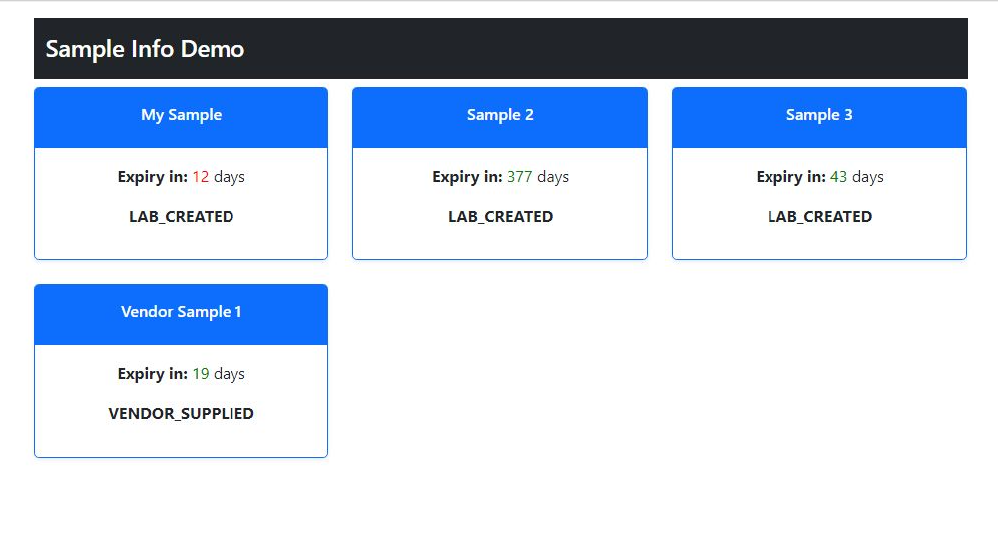
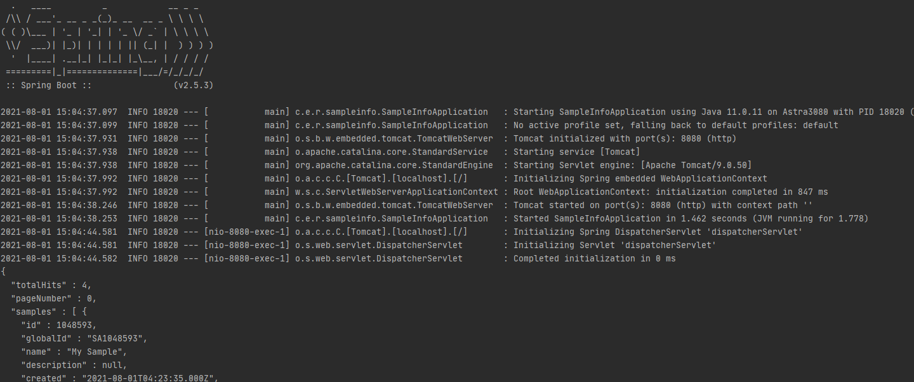

## Explanation
Spring is used as the middle man for your API here, which is then requested by the React frontend to represent the data.

I decided on this process to show my ability to work with Spring and even be able to effectively use it with other frameworks and libraries.
The JSON parsing is handled on the hypothetical frontend side, in order to alleviate work from the Spring backend. 

The cards on the page display the expiry in days and change colour depending on how many days left, and also displays the samples source.

## Running Demo
- In order to run this, you first need to run the SampleInfoPageController.
- After that, run npm install in the frontend folder, and then npm start to start the server.

## Images Of Demo

This is what the frontend react UI looks like.

This is the Spring server receiving JSON from the API request.